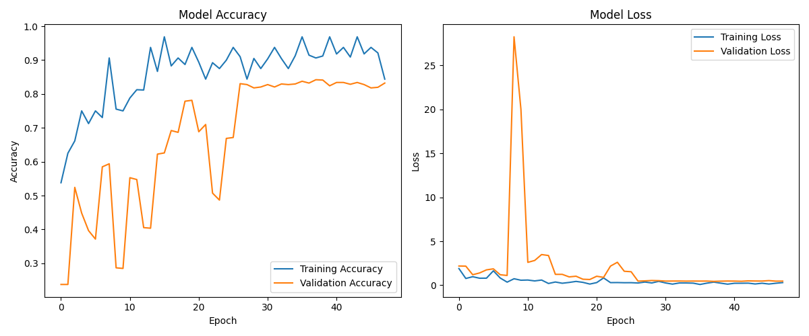
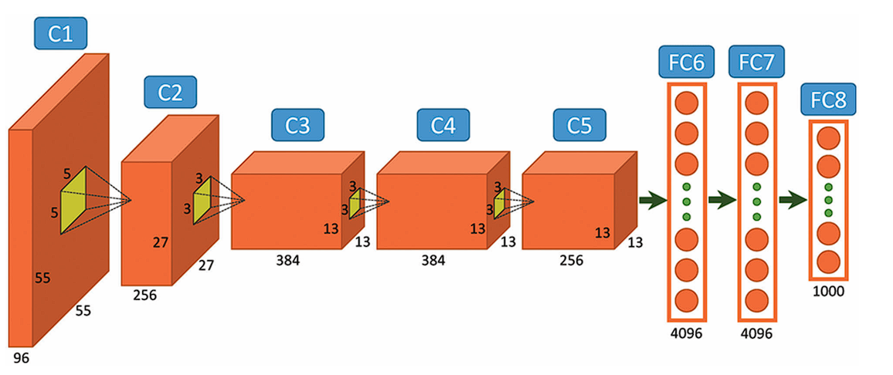
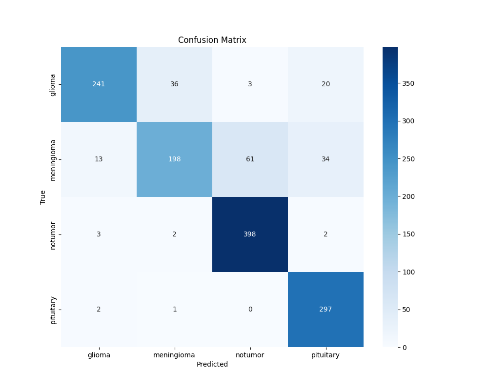

# cnn_alexnet_brain_tumor
1.1 Summary
Using a CNN based on AlexNet architecture to differentiate different types of tumors and those without tumors. This model achieves 82% - 84% validation accuracy on a test data set with more than 1000 photos of tumors.

1.2 AlexNet Architecture
8 total layers, 3 of which are fully connected layers.

Images have to be of size 277x277x3. To resize the tumor images, we simply specify the size in the training function provided by the TensorFlow library.
C1 has 96 filters of size 11x11 with stride 4. ReLU activation.
C2 has 256 filters of size 5×5 with padding 2. ReLU activation.
C3 has 384 filters of size 3×3 with padding 1. ReLU activation.
C4 has 384 filters of size 3×3 with padding 1. ReLU activation.
C5 has 256 filters of size 3×3 with padding 1. ReLU activation.
FC6 and FC7 have 4096 neurons and a 50% dropout rate. ReLU activation.
FC8 has 1000 neurons and softmax activation.
1.3 Performance insights

The model’s accuracy and validation loss seem to stabilize after epoch 25. To train the model up to 40 epochs, it takes around 8 minutes.
Glioma
Accuracy: 80.33% (241/300)
Precision: 93.05% (241/259)
Recall/Sensitivity: 80.33% (241/300)
Specificity: 97.86% (1009/1031)
F1 Score: 86.22%
Meningioma
Accuracy: 64.71% (198/306)
Precision: 83.54% (198/237)
Recall/Sensitivity: 64.71% (198/306)
Specificity: 96.17% (986/1025)
F1 Score: 72.94%
Notumor
Accuracy: 98.27% (398/405)
Precision: 86.15% (398/462)
Recall/Sensitivity: 98.27% (398/405)
Specificity: 93.06% (869/934)
F1 Score: 91.82%
Pituitary
Accuracy: 99.00% (297/300)
Precision: 84.13% (297/353)
Recall/Sensitivity: 99.00% (297/300)
Specificity: 94.32% (978/1037)
F1 Score: 91.01%
1.4 Discussion
Meningioma has been wrongly identified as no tumor 64 times out of 306, resulting in a low 64% sensitivity. In medical cancer screening, it is better to have a higher sensitivity than having a higher specificity. This is because it is okay to wrongly identify a no tumor as a tumor but it would be catastrophic if we identify a tumor as no tumor.
